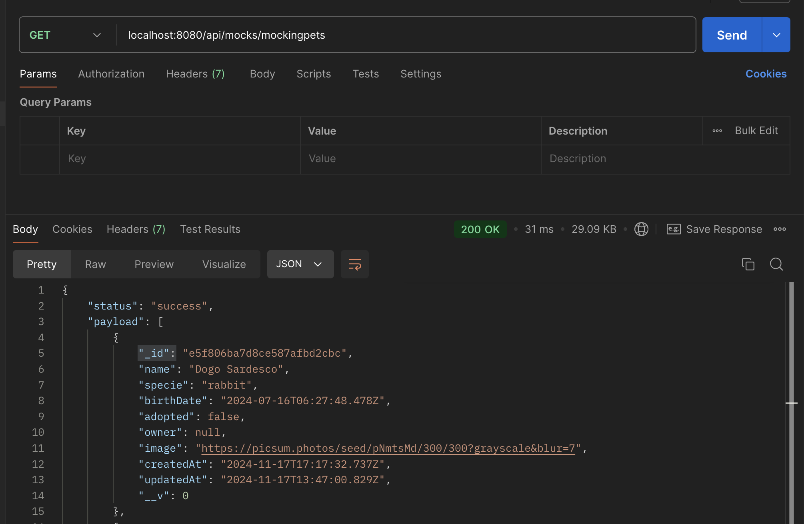
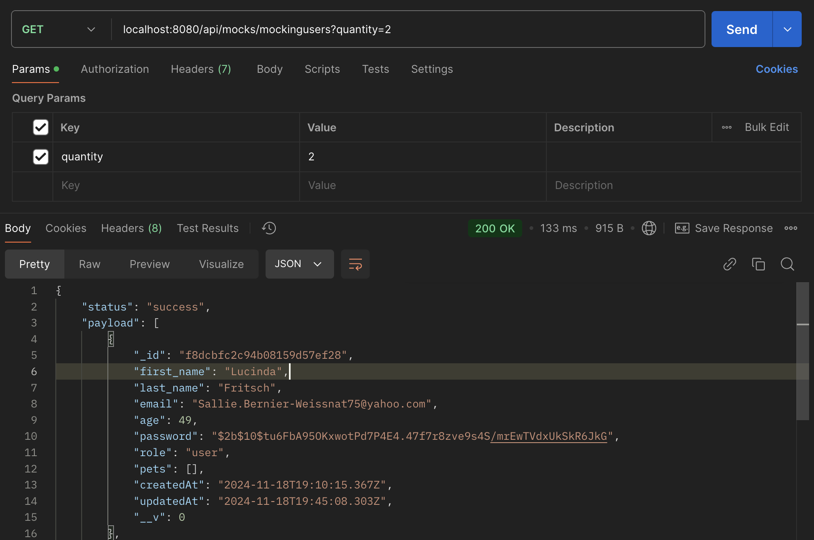
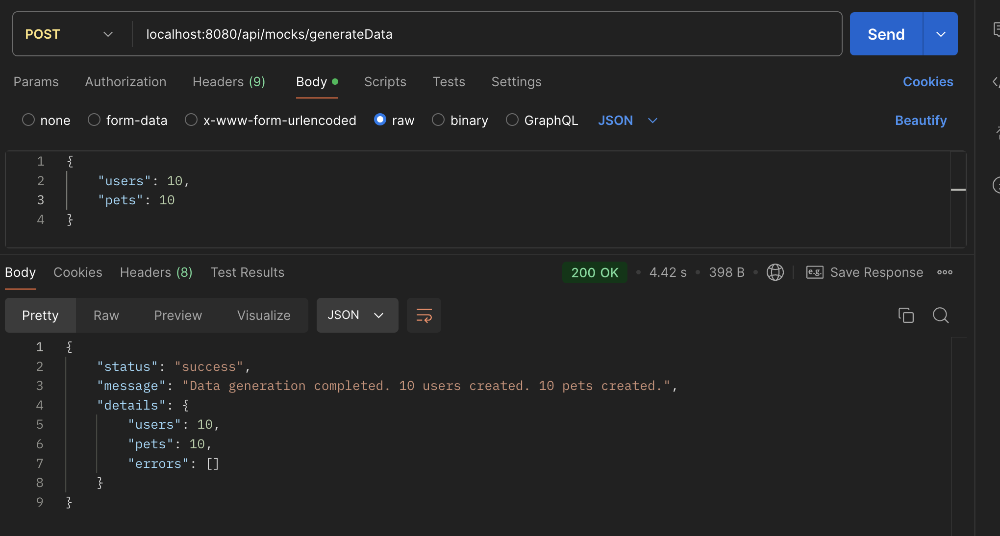
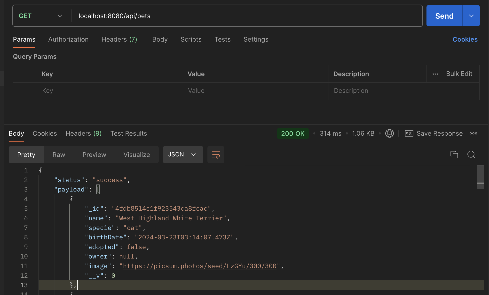
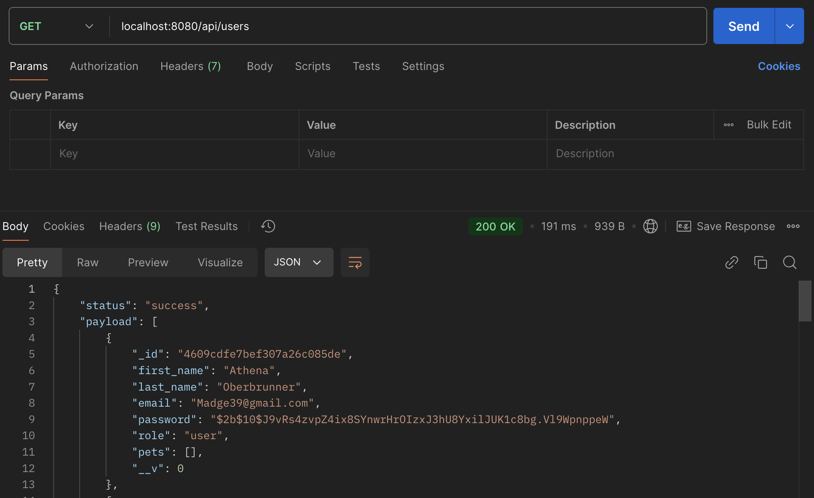
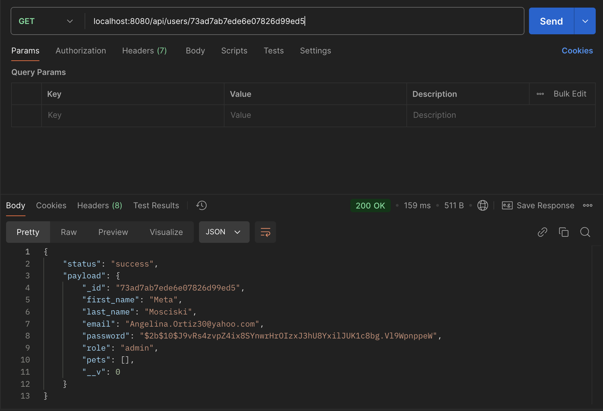

# jcampos_adoptme_bk
## Descripción
Un servicio de backend para el sistema de gestión de adopción de mascotas que proporciona API para administrar mascotas y usuarios.

## Prerequisitos
- Node.js
- npm
- MongoDB

## Instalación
1. Clonar repositorio
```sh
git clone git@github.com:josybett/jcampos_adoptme_bk.git
```

2. Crear archivo .env con los valores de .env.example

3. Instalar dependencias
```sh
npm install
```

4. Ejecuta las pruebas con:
```sh
npm start
```

## Rutas de API
### Api Mocks
1. [x] Mocks Pets
- Método: GET
localhost:8080/api/mocks/mockingpets?quantity=1


2. [x] Mocks Users
- Método: GET
localhost:8080/api/mocks/mockingusers?quantity=2


3. [x] Mocks Generate Data
- Método: POST
localhost:8080/api/mocks/generateData
- Request:
```sh
{
    "users": 10,
    "pets": 10
}
```



### Api Pets
1. [x] Consultar pets
- Método: GET
localhost:8080/api/pets



### Api Users
1. [x] Consultar users
- Método: GET
localhost:8080/api/users


2. [x] Consultar user por id
- Método: GET
localhost:8080/api/users/:id



