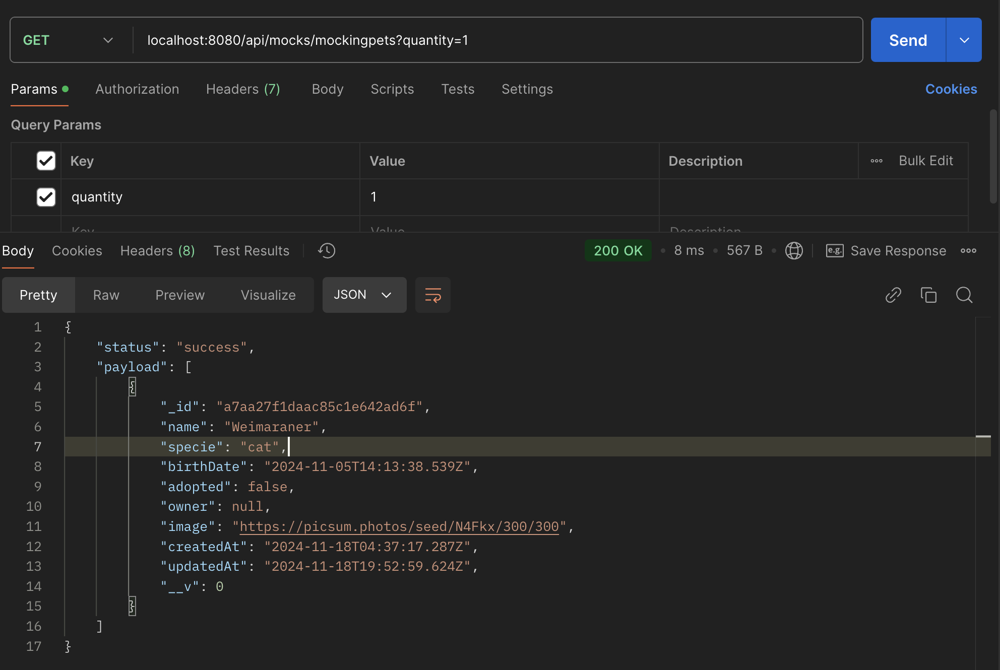

# jcampos_adoptme_bk
## Descripción
Un servicio de backend para el sistema de gestión de adopción de mascotas que proporciona API para administrar mascotas y usuarios.

## Caracteristicas del proyecto
- API RESTful para interactuar con la base de datos.
- Autenticación y autorización para usuarios.
- Gestión de mascotas (crear, leer, actualizar y eliminar).
- Gestión de usuarios (crear, leer, actualizar y eliminar).
- Validación de datos de entrada.
- Documentación de API en swagger.

## Tecnología aplicada
- Node.js
- Express.js
- MongoDB
- Mongoose
- JWT

### Tecnologías para desarrollo
- Chai
- Supertest
- Mocha

## Funcionalidades
- **Crear Mascotas**: Permite a los usuarios crear nuevas mascotas con información como nombre,
edad, raza, sexo, y estado de salud.
- **Crear Usuarios**: Permite a los usuarios crear nuevos usuarios con información como nombre,
apellido, correo electrónico, y contraseña.
- **Asignar Mascotas a Usuarios**: Permite a los administradores asignar mascotas, que sería la adopción
de una mascota, a los usuarios.
- **Listar Mascotas**: Permite a los administradores y usuarios listar todas las mascotas
existentes en el sistema.
- **Listar Usuarios**: Permite a los administradores y usuarios listar a todos los usuarios
existentes en el sistema.

## Prerequisitos
- Node.js
- npm
- MongoDB

## Instalación
1. Clonar repositorio
```sh
git clone git@github.com:josybett/jcampos_adoptme_bk.git
```

2. Crear archivo .env con los valores de .env.example

3. Instalar dependencias
```sh
npm install
```

4. Ejecuta el proyecto en local:
```sh
npm start
```

5. Mientras estás ejecutando el proyecto, puedes ver el resultado de los test implementados:
En otra consola ejecuta la siguiente línea
```sh
npm tes
```

## Ejecutar docker
```sh
docker pull josybett/jc-adoptme-coder
```
URL dcokerhub: https://hub.docker.com/r/josybett/jc-adoptme-coder

## Documentación swagger
```sh
http://localhost:8080/apidocs/
```


## Rutas de API
### Api Mocks
1. [x] Mocks Pets
- Método: GET
localhost:8080/api/mocks/mockingpets?quantity=1


2. [x] Mocks Users
- Método: GET
localhost:8080/api/mocks/mockingusers?quantity=2


3. [x] Mocks Generate Data
- Método: POST
localhost:8080/api/mocks/generateData
- Request:
```sh
{
    "users": 10,
    "pets": 10
}
```


### Api Pets
1. [x] Consultar pets
- Método: GET
localhost:8080/api/pets


### Api Users
1. [x] Consultar users
- Método: GET
localhost:8080/api/users


2. [x] Consultar user por id
- Método: GET
localhost:8080/api/users/:id


